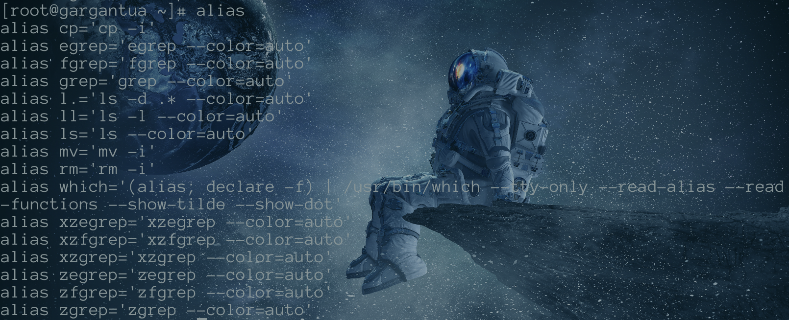

## shell

1. 什么是shell

- 一种命令解释器
- 一种编程语言
  - shell
  - python
  - perl


2. 当前系统支持哪些shell

`# cat /etc/shells`


3. 如何改变当前shell

`usermod , chsh`


4. 登录shell与非登录shell

- 登录：以sh结尾的shell
- 非登录：/sbin/nologin


5. 父shell与子shell

`子shell能够继承父shell的环境变量`


6. 环境是什么

`命令、变量、资源`


7. 如何配置环境

- /etc/profile
- /etc/bashrc
- ~/.bash_profile     //配置root用户的环境变量
- ~/.bashrc          
- /home/tom/.bashrc   //配置tom用户的环境变量

`所有用户登录都会加载这四个配置文件`

`/etc 下两个为全局环境配置文件，家目录下两个只对用户本人生效`


8. linux命令分类

- 内嵌   `ls ifconfig`
- 外部   `javac`
- 别名   `alias`
  - 查询别名	`alias`
    - 
  - 设置别名    `alias 命令名称='动作'`  例如`ls -l=ll`
    - 
  - 取消别名    `unalias 别名名称`
- 函数


9. 历史命令

`history`默认只记录1000条

`history -c`清除历史命令


10. 算术运算
    1. echo $[] 或 echo $(()) 只能计算整数
    2. bc                                  可计算小数
    3. let                                  用作变量赋值


11. 创建shell脚本

- #！开头表示此程序由什么解释器来解释     `#!/bin/bash`

- #开头表示注释
- 加上可执行权限

```shell
#!/bin/bash
echo "用户名 $USER"
echo "主机名	$HOSTNAME"

echo "ip		`hostname -I`"	#利用反引号，首先执行反引号内的命令
或者
echo "ip		$(hostname -I)"

chmod +x a.sh 
```


12. 执行shell脚本(存在a.sh脚本)

- bash a.sh


PS：

```bash
useradd tom	#创建用户
su - tom		#切换用户

/bin  存放普通用户的命令
/sbin 存放root用户命令

ln -s /tmp/a.sh /bin/test	创建软链接
# test即可运行a.sh
```

